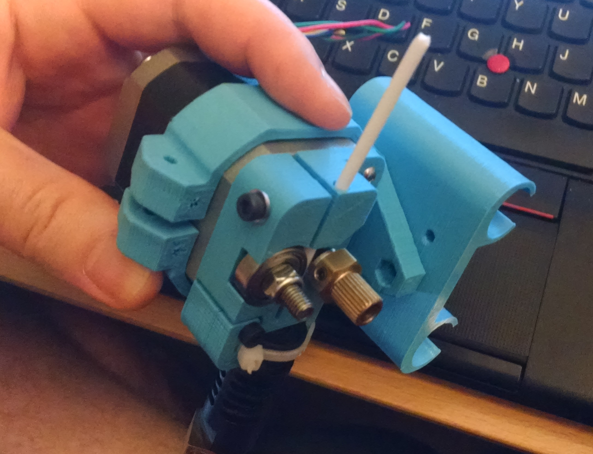

A perimetric modular carriage + extruder system.

Heavily inspired by http://www.thingiverse.com/thing:321523

Currently designing for direct-driving 3mm filament.  Note that you'll likely want to use a 0.9 degree (400-step) motor to have sufficient steps/mm and/or 1/32 microstepping.

The design is parametric and should be able to be changed to 1.75mm filament if you so desire -- see 'filament_diam' variable.

The idea is that the extruder bolts to the face of the motor, then the motor is clamped to the x carriage in some way, assuming an XZ/Y printer.  Currently designing for a Graber/Prusa i3 vertical carriage, but a wades-style two-hole mounting system shouldn't be hard at all.

